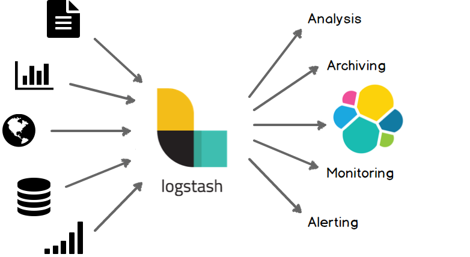
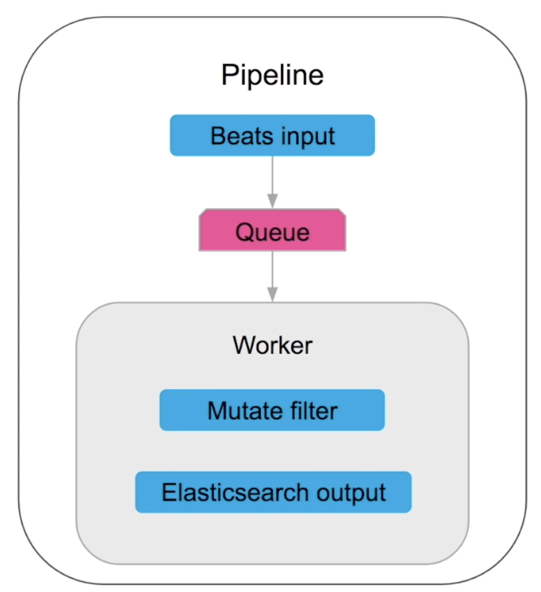
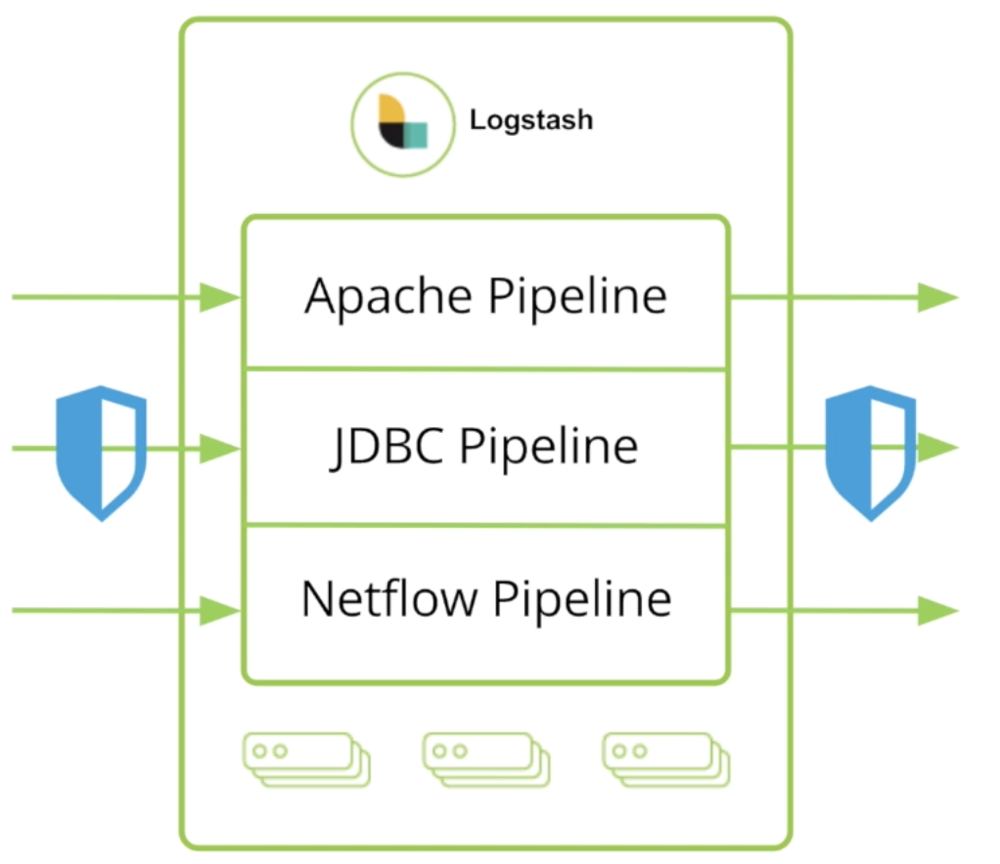
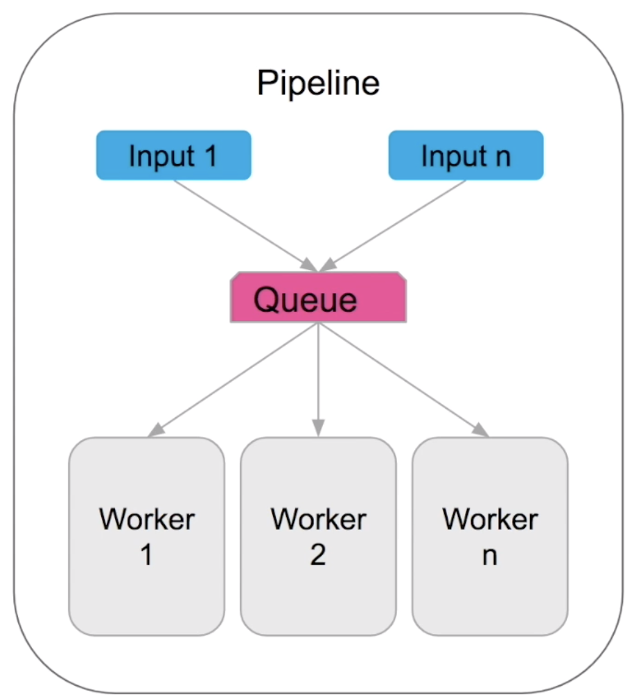
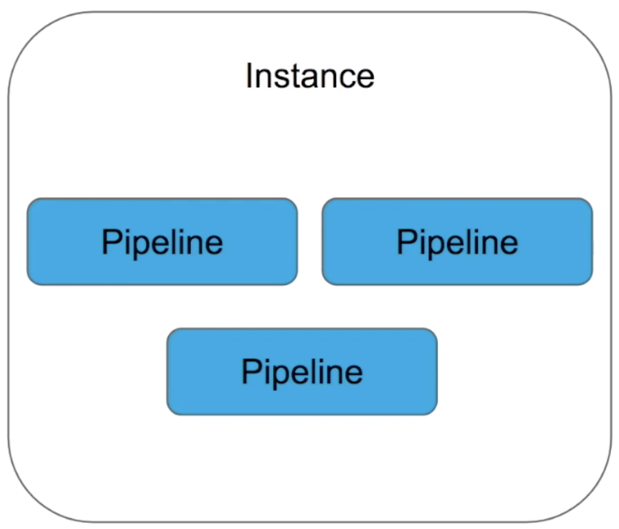
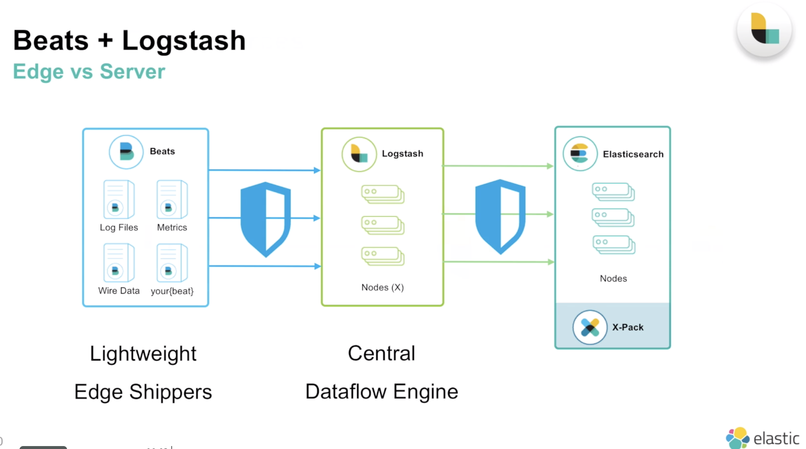
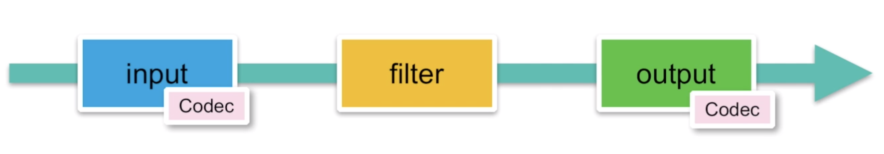
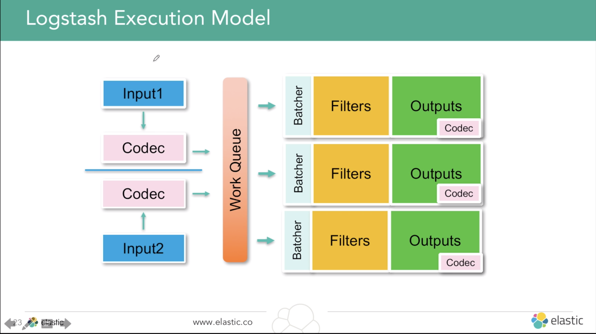
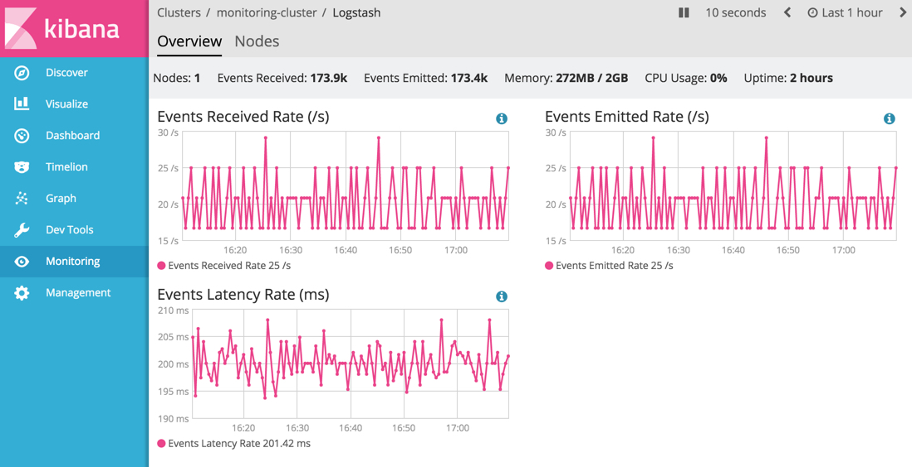

---
search:
    keywords: ['elastic stack', 'logstash']
---

## Log 를 이해하고 Logstash 사용하자
- Logstash를 사용할때 왜 log를 이해하는 것이 필요할까?
  - Logstash 의 **collection(수집)과 centeral aggregation(집중식 취합)** 의 강점을 활용하기 위해서
  - log 의 특성을 파악해야 로그 메시지 구조에 따라 어떤 데이터를 남겨서(filtering) 다음 분석도구(예. Elastic Search)에 넘길 것인지, 포맷 정규화는 어떻게 할 것인지 등 logstash의 plugin을 적절하게 사용할 수 있음
    - 무엇을 logging 할지 제대로 정의되지 않아서 이상한 loggin만 했다면, 아무리 log를 많이 수집해도 원하는 분석을 실행할 수 없음.
- 단, Logstash는 단순히 log만 다루는 것이 아님. Elastic에서는 Logstash를 DataFlow Engine이라고 정의하며, log를 넘어서 Data를 수집,변환,적재하는 확장된 목적으로 사용이 가능.
- log 란?  
  - log message 는 컴퓨터 시스템, 장치, 소프트웨어 등에서 발생하는 특정한 sitimulation에 대응해 발생함
   - Informational 정보 / Debug / Warning / Error / Alert  다섯 가지 분류로 나눌 수 있음 
- log message 형태:
  - Timestamp(로그 시간) + data(정보) 로 구성되어 있음
- logging의 중요 단계는 아래와 같음
  - 질의와 계획(무엇을 언제 logging할 것인가?) → 로그 메시지 생성(log 만들기) → 로그 메시지 필터링과 정규화(low,medium,high) → 로그 메시지 수집 →  로그 분석 → 로그 메시지 장기보관
- Log 분석에서 주의해야하는 점은 아래와 같음 →  logstash를 통해 해결
  - No common/consistent format → filtering해서 원하는 형태의 데이터로 만들자
  - Logs are decentralized →  log를 모으자. logstash는 다양한 형태의 input을 모으기 쉬움
  - No consistent time format → data filter plugin으로 timestamp를 정규화하고, grok로 date를 뽑아냄
  - Data is unstructured → filtering 사용해 원하는 field를 뽑아내고, json plugin 등을 사용해 구조화함  

## 왜 logstash를 사용할까?
1. log 써먹으려고 - 서버 / 애플리케이션 모니터링(에러 리포트,..)
    - 서버에서 바로 log 보면 안될까? `grep "Error"` 처럼
      - 단일 서비스 - 단일 서버 : 응답시간 모니터링, 에러 리포트 등 *무엇을 분석할지* 정의되어있다면  CLI로 log분석 가능함
      - **하지만** 대다수의 서비스는 분석할 로그가 너무 많아서 어떤 걸 봐야할지 불가능한 상황이 발생. '단일 서비스 - 다수 서버' 혹은 '다수 서비스 - 다수 서버' 로 구성되어있기때문
      - 이 말인즉슨, 로그 확인을 위해 여러 서버에 동일 명령을 사용 가능한 ssh 멀티플렉서를 사용한해서 각 개별 호스트에 접속하는 불편함을 줄인다고 하더라도,
      - 호스트들에서 발생하는 수천 줄 로그에서 에러찾기, 에러 찾아도 한 서버가 오동작하는지 시스템 전체 문제인지 판별을 하고 호출 체인타고 들어가서 에러 추적하고 원인 찾기를 해야함 - 이건 아닌거 같습니다 쓰앵님
-> 현대 서비스 환경에서는 로그부터 **가능한 한 많은 collection(수집)과 ceteral aggregation(집중식 취합)을 하는게 중요** 함. 그럼 이렇게 취합한 많은 로그를 어떻게 써먹을까? 위처럼 직접 분석하는 방법은 매우 쓰기 힘들어보임
-> 로그 파일 포맷을 파싱하고 분석을 위한 추가 서비스(e.g. elastic stack)에 전송할 수 있는 파이프라인이 필요함. **logstash** 처럼

2. 다양한 데이터 통합하고 정규화해서 필요한 부분의 데이터를 바로 쏙쏙 뽑아내려고(Filtering / streaming)
- logstash는 log수집뿐만 아니라 다양한 데이터 정리 및 변환이 가능하도록 여러 plugin을 지원. 
- 기존에 보유하고 있었던 로그, DB data 뿐만 아니라 데이터 스트림, Http요청 이벤트 변환, HTTP 엔드포인트 폴링으로 이벤트 생성까지 가능함. 이건 나중에 여러 방향으로 확장이 가능.
  - 예를 들면, Http요청을 이벤트로 변환해서 twitter 정보를 webservice firehoue(a steady stream of all available data from a source in realtime)활용이 가능해짐 -> 실시간 데이터가 중요한 socialTreand 분석이 유용해짐 

**결론.**
- 그러니까, logstash를 사용해서 **여러 형태의 Input**을 받아 **Filtering**을 해서 다른 분석에 활용할 수 있도록 **정해진 형식의 output**으로 뽑아낼 수 있음, **실시간으로 다른 저장소에 넘기면서** ! 

- 위 이야기를 멋있게 쓰면 아래와 같음. ([elastic 공식 소개]((https://www.elastic.co/kr/webinars/getting-started-logstash)), [가이드라인](https://www.elastic.co/guide/kr/logstash/current/introduction.html))

> Logstash는 실시간 파이프라인 기능을 가진 오픈소스 데이터 수집 엔진(DataFlow Engine)입니다. Logstash는 서로 다른 소스의 데이터를 탄력적으로 통합하고 사용자가 선택한 목적지로 데이터를 정규화할 수 있습니다. 다양한 고급 다운스트림 분석 및 시각화 활용 사례를 위해 모든 데이터를 정리하고 대중화(democratization)합니다.
포맷이나 스키마에 관계 없이, 모든 데이터를 수집하고 강화 및 통합하기 위한 Elastic Stack의 중앙 데이터 플로우 엔진으로 Logstash의 실시간 데이터 처리는 Elasticsearch, Kibana, Beats와 연동될 때 더욱 강력해집니다.

[Elastic Webinar - Getting started logstash](https://www.elastic.co/webinars/getting-started-logstash?baymax=rtp&elektra=docs&storm=top-video&iesrc=ctr)  

> - 데이터 흐름을 위한 오픈소스 중앙처리 엔진
> - dataflow 파이프라인 구축하여 이벤트 데이터의 변환 및 스트림 설정
> - 다양한 데이터 자원 접근
> - 원시 버퍼링을 통한 수평적인 스케일링
> - 통합 처리를 위한 탄탄한 플러그인 환경

-------

## 기본 개념 - 6가지

### 들어가기 전
- **서비스에 '어떤 데이터'가 필요한지 정의하고 여기에 따라 '어떤 플러그인'을 선택하여 데이터를 필터링할 것인가? 를 고민하는게 설계의 핵심임**
  - [Salesforce Engineering - Our Journey to a Near Perfect Log Pipeline](https://engineering.salesforce.com/our-journey-to-a-near-perfect-log-pipeline-6ae2f80cf7a0)
- Event : logstash의 기본 데이터 단위(primary unit of data), JSON과 유사하게 dl계층과 type 지원함 (arbitrary hierachies and types supported)

### Pipeline
- *주의. log data pipeline에서의 pipeline이 아닌 logstash instance에 있는 pipeline을 의미함.*
- 데이터 처리를 위한 logstash 설정으로 **하나**의 logical data flow를 말함. 하나의 logstash instance에 여러 개의 pipeline이 존재할 수 있음

- Input - Queue - Worker로 구성되어있으며, Input plugins,Filter plugins, Output plugins 세 가지 설정을 통해 순차적으로 실행됨
1. Input을 통해 data를 받고 
2. Queue(kind of bufferd data)를 통해 
3. worker(filer/ output section, scale in-out 단위가 됨)로 넘김.

#### Pipeline Can Scale
- Conditionals & multiple pipeline + Secure transport with authentication & wire encryption
  - [Stitching Together Multiple Input and Output Plugins](https://www.elastic.co/guide/en/logstash/current/multiple-input-output-plugins.html#multiple-input-output-plugins)

- Multiple Input & Multiple Worker

- 하나의 process에서 작동하는 One Logstash, Many Pipeline

### Plugin
- 각 단계(Input, Filter, Output)는 여러 플러그인 조합으로 구성하며, Input -> Filter -> Output이 순차적으로 실행됨.
  - 예를 들어, Input은 File Plugin으로, Filter는 JSON plugin 그리고 Output에는 ElasticSearch plugin으로 구성한다면, 파일로부터 데이터를 가져와서 ElasticSearch에 저장가능한 JSON형태로 변환한 후 ElasticSearch로 Indexing하게 됨.
- 각 단계를 조합하는 Plugin의 사용법은 비슷비슷해서 사용법의 학습비용은 크지 않음. 
- 원하는 plugin도 만들어서 사용할 수 있음. 참고: [Elastic - how to write a logstash output plugin](https://www.elastic.co/guide/en/logstash/current/_how_to_write_a_logstash_output_plugin.html)

### Input
- 데이터가 유입되는 근원지. Input Plugins을 사용해 특정 소스의 이벤트(데이터)를 가져옴. 
- logs & Files, Metrics, Wire Data, Web Apps, Data Stores, Data Streams 등의 수집을 지원함. [Elastic Reference - input-plugins](https://www.elastic.co/guide/en/logstash/current/input-plugins.html)을 보면 많은 종류의 Input을 가져올 수 있도록 지원함. 사용법은 거의 비슷함.
- **Beats**와 결합해서 쓰는 것도 가능함

### Filter
- log parsing, stricture, transform, 데이터 확장, 태그 추가 등 의 데이터 변형 작업을 함. Filtering 과정은 필수가 아님. 
- 자주 쓰이는 Filter plugin 5가지는 아래와 같음
- [gork](https://github.com/logstash-plugins/logstash-filter-grok)
  - 문자열 데이터에서 필요한 데이터를 뽑아내려면 정규표현식으로 원하는 내용만 뽑아내야함. grok은 자주 쓰이는 정규표현식 패턴이 사전정의되어있어 패턴을 골라서 사용하면 됨. 
  - [logstash-patterns-core](https://github.com/logstash-plugins/logstash-patterns-core/tree/master/patterns)를 보면 aws, maven, redis 등등의 로그 패턴을 볼 수 있음.
- [mutate](https://www.elastic.co/guide/en/logstash/current/plugins-filters-mutate.html)
  - 데이터 필드 단위로 변형할 수 있음. 예를 들면, 필드를 변경하고 합치고(join), 이름을 변경할 수 있음.
  - elastic search 에서 indexing된 data를 변경하는 것은 상대적으로 어려움. indexing 전에 필드를 변경해서 넘기는 것이 속도도 빠르고, 불필요한 indexing을 줄이면서 elasticsearch에 전송하는 데이터양도 줄일 수 있음.
- [date](https://www.elastic.co/guide/en/logstash/6.6/plugins-filters-date.html) : String을 Data타입으로 변환함. 날짜를 string타입으로 Elastic Search에서 indexing하면 Query나 Aggreagtion할때 문제가 발생할 수 있기 때문임.  
- [json](https://www.elastic.co/guide/en/logstash/6.6/plugins-filters-json.html) : input의 JSON 데이터 구조를 유지 
- [kv](https://www.elastic.co/guide/en/logstash/6.6/plugins-filters-kv.html#plugins-filters-kv-target) : 위 JSON처럼 Key-value 형태로 구문분석 유지
- [Elastic - filter plugins](https://www.elastic.co/guide/en/logstash/current/filter-plugins.html)

### Output
- 데이터를 전송할 목적지. 가공된 데이터를 '어딘가의 저장소'에 적재함. Elastic Search, RDBMS 처럼 '어딘가'에 저장할 것인지는 Output plugin으로 결정됨. 
- [Elastic Reference - output-plugins](https://www.elastic.co/guide/en/logstash/current/output-plugins.html)

### Codec plugin
- 데이터 인코딩 & 디코딩. 메세지(들어오는 데이터)를 쉽게 구분하고 전송할 수 있도록 하는 input단계에서는 Deserialization, output 단계에서는 Serialization 위해 사용되는 stream filter. 

- 많이 쓰이는 것으로는 json, msgpack, plain (text), multiline(여러 줄로 이루어진 로그를 하나의 메시지로 다룸)
- [Elastic Reference - codec-plugins](https://www.elastic.co/guide/en/logstash/current/codec-plugins.html)

------
## [Execution Model](https://www.elastic.co/guide/en/logstash/current/execution-model.html)   

   

- pipeline은 Input(with codec) → Filter → Output(with codec)  세 단계의 plugin작업을 실행하며 순차적으로 동작함.
- Fliter작업은 Work Queue 에서 이루어지므로 Worker 를 늘려주면 빠르게 작업할 수 있음. → logstash Tunning 시에 중요포인트가 됨
- 기본적으로 Logstash 에 Data 를 집어넣을때 Batch형태로 넣으면서(Bulk API를 사용) Batcher가 Fliter에 보내는 형태로 작동함

## Queuing and Delivery Guarantees
### In Memory Queue(default)
- 매우 빠름
- 모든 데이터를 메모리에 저장함
- 영속성 없음(Not durable)
  - 비정상적인 종료(unclean shutdown)이 일어날 경우 Queue로 전송되던 data(in-flight data)를 잃을 수 있음

### Persistent Queue (PQ)
- 빠름
- worker에 전달할때까지 받은 데이터를 저장함(Stores received data on disk until delivered)
- 영속성 (durable) : 비정상적인 종료(event of unclean shutdown)시에도 데이터를 잃지 않음

### At Least Once Delivery
- 모든 메시지는 딱 한번만 전송됨(delivered). 거의 모든 플러그인이 지원함 (지원되지 않는 플러그인도 있음)
- 멱등(Idempotent, 연산을 여러 번 하더라도 결과가 달라지지 않음) operation
  - PQ(Persistent Queue)에서 비정상적인 종료가 되어서 Worker section(filter + output)에서 중복 메시지를 보내더라도 딱 한번만 연산됨
  - 어떻게? [Elastic blog - Little Logstash Lessons: Handling Duplicates](https://www.elastic.co/blog/logstash-lessons-handling-duplicates)

### Dead Letter Queue
- [Logstash Lines: Grok debugger, Dead letter queues](https://www.elastic.co/blog/logstash-lines-2017-05-16)
## Ingest Data
### Immediate Insights with Modules (30:40)

# Data Transformation 
## Serialized with Codec (37:48)

# Logstash Administration (47:00)
##  Monitoring
- Monitoring UI
- Pipeline Viewer
- Monitoring API

## Pipeline Management

---------

## 그리고... 
- 파이프라인 구성 : 복잡한 코딩 배제하고 먼저 ,파이프라인 구성 후에 첫 이벤트 빨리 구축 -> 주기적으로 수평적인 확장
- [Elastic - Logstash performance-troubleshooting](https://www.elastic.co/guide/en/logstash/current/performance-troubleshooting.html)
- [Elastic - Tuning and Profiling Logstash Performance](https://www.elastic.co/guide/en/logstash/current/tuning-logstash.html)
### [Data resiliency](https://www.elastic.co/guide/en/logstash/current/resiliency.html)
- [Dead letter queue with ElasticSearch](https://www.elastic.co/guide/en/logstash/current/dead-letter-queues.html)

## 활용
### [logstash monitoring](https://www.elastic.co/guide/en/logstash/current/monitoring-logstash.html)

- logstash가 제대로 구동되고 있는지 상태를 모니터링하는게 중요함. [cluster monitoring](https://www.elastic.co/kr/products/stack/monitoring)을 통해 logstash 상태를 실시간 조회하고 과거 성능 분석에 활용할 수 있음. 
- 제공하는 API를 사용하거나, [X-pack](https://www.elastic.co/guide/en/kibana/current/logstash-page.html) 을 통해 kibana에서 모니터링 가능함.
- 제공하는 정보는 아래와 같음.
  - Logstash node info, like pipeline settings, OS info, and JVM info.
  - Plugin info, including a list of installed plugins.
  - Node stats, like JVM stats, process stats, event-related stats, and pipeline runtime stats.
  - Hot threads.

## 질문
- 단일 server에 Elastic Search와 logstash 둘 다 동작시켜도 괜찮을까?
  - 어떤 서비스를 하느냐에 따라 달라짐. 두 시스템이 충분히 동작할만한 RAM 용량을 확보해야하며, 모니터링하면서 적절한 파악해야함. logstash는 beats보다 resouce 를 많이 사용하므로 단일 서버에 설치하는 것을 권장함.
  - 참고 : [Elastic - Sizing Elasticsearch](https://www.elastic.co/blog/found-sizing-elasticsearch)
  - 참고 : [Elastic - elasticsearch-in-production](https://www.elastic.co/blog/found-elasticsearch-in-production)
- Beats 를 사용해야할까, logstash를 사용해야할까?  [차이점은](https://www.elastic.co/guide/en/beats/filebeat/1.1/diff-logstash-beats.html)?
  - Beats([참고 - Elastic - beats](https://www.elastic.co/guide/en/beats/libbeat/current/beats-reference.html))는 logstash보다 경량화된 데이터를 수집 agent임.  하지만  입/출력 만 있고 filtering이 없음.
    - apach weblog처럼 널리 쓰이는 로그를 간편하게 수집만 하고 싶다면 logstash보다 가볍게 사용 할 수 있음. 사용자 정의 beat도 libbeat 라이브러리를 사용하여 쉽게 빌드 할 수 있음. 
  - 아래 그림처럼 beats에서 수집한 데이터를 logstash로 보내서 필터링한 후에 사용하는 것도 가능함
  

- Elastic Search의 [IngestNode](https://www.elastic.co/guide/en/elasticsearch/reference/5.0/ingest-processors.html)(문서 indexing 전 데이터 전처리하는 역할의 node)가 logstash의 역할을 대신해줄 수 있을까?
  - [Elastic - Logstash를 사용해야 하나요, Elasticsearch 수집 노드를 사용해야 하나요?](https://www.elastic.co/blog/should-i-use-logstash-or-elasticsearch-ingest-nodes)
    - IngestNode의 경우 단일 pipeline으로 구성되어 좀 더 간단할 수 있으나, 사용목적에 따라 적절하게 선택하세요
    - [DZone - elasticsearch ingest-node VS logstash performance 비교](https://dzone.com/articles/elasticsearch-ingest-node-vs-logstash-performance-2)
  - Elasticsearch 5.0 이전에는 색인을 생성하기 전에 문서를 사전 처리하려는 경우 Elasticsearch, 그 다음 유일한 방법은 Logstash를 사용하거나 사전 처리하는 것이었음. Elastic 6.X에 들어오면서 IngestNode가 추가됨
    - [Elastic - New Way To Ingest](https://www.elastic.co/blog/new-way-to-ingest-part-1)

--------
## UseCase - 실제 필드에서는 어떻게 사용되고 있나?
- kor webinar 40:36

-------
## Referece
- 인용은 본문에 링크 달아두었음 
- [Elastic guide - logstash(Eng)](https://www.elastic.co/guide/en/logstash/current/) -  2019.02.13 현재, 한글로 번역된 최신 가이드 버전은 5.4임
- [Elastic Webinar - Getting started logstas(Kor)](https://www.elastic.co/kr/webinars/getting-started-logstash)
- [Elastic Webinar - Getting started logstash](https://www.elastic.co/webinars/getting-started-logstash?baymax=rtp&elektra=docs&storm=top-video&iesrc=ctr)
- [discuss.elastic - logstash](https://discuss.elastic.co/c/logstash/) : elastic의 discussion 페이지
- [책 - Learning Elastic Stack 6.0](https://learning.oreilly.com/library/view/learning-elastic-stack/9781787281868/)
- [5 Logstash Filter Plugins You Need to Know About](https://logz.io/blog/5-logstash-filter-plugins/)
- [A Beginner’s Guide to Logstash Grok](https://logz.io/blog/logstash-grok/)

### 기타 개념
- [책 - 실전 LOG 분석과 체계적인 관리 가이드](http://acornpub.co.kr/book/logging)
- [책 - 마이크로서비스 아키텍처 구축: 대용량 시스템의 효율적인 분산 설계 기법 - 8장 모니터링]
- [What is a Data Firehose API?
](https://www.pubnub.com/blog/what-is-a-data-firehose-api/)